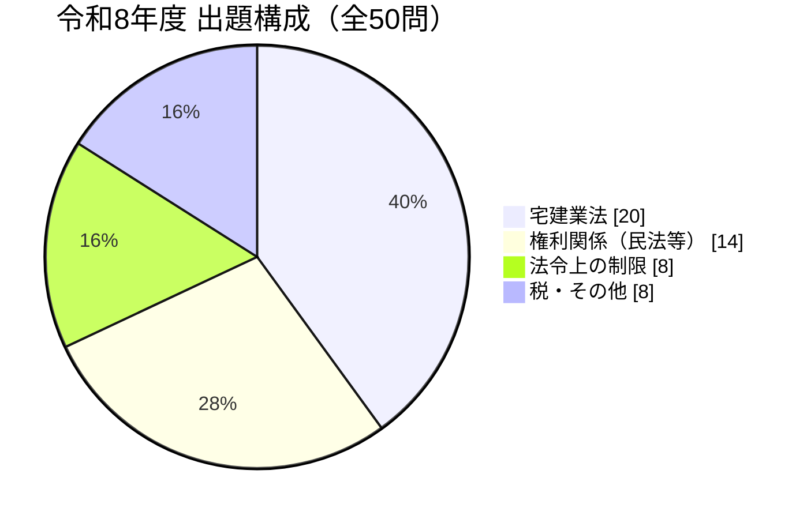
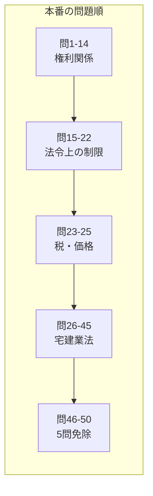
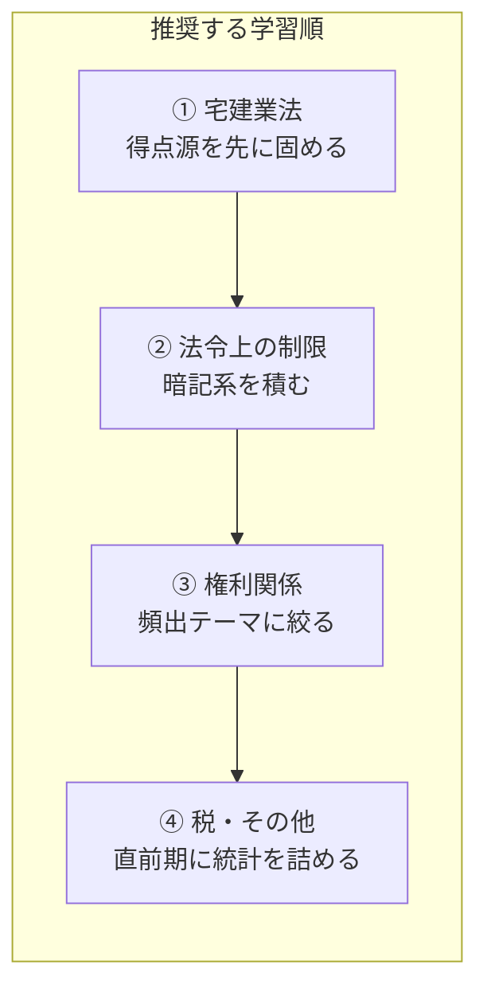
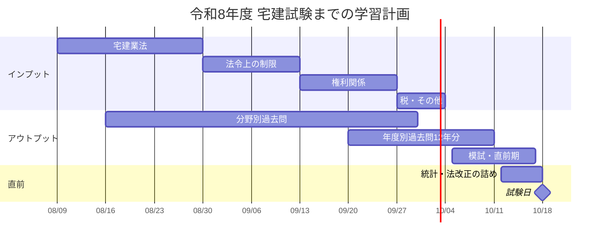

# 宅建士試験 学習ドキュメント（2026年度／令和8年度 対応）

宅地建物取引士資格試験の理解を助けるための学習ドキュメント集です。
**テキストで説明するだけでなく、図・表・チャートで「構造」を見せる**ことを最優先の方針としています。

> [!IMPORTANT]
> **法令基準日は 2026年（令和8年）4月1日**。
> この日時点で施行されている法令が出題対象です。2026年4月2日以降に施行された改正は出題されません。
> 逆に、2026年4月1日に施行された改正（区分所有法の大改正など）は **出題対象** です。

---

## 1. 試験概要（令和8年度・官報公告済み）

| 項目 | 内容 |
|---|---|
| 試験日 | **2026年（令和8年）10月18日(日) 13:00〜15:00**（2時間） |
| 登録講習修了者 | 13:10〜15:00（1時間50分）／**問46〜50の5問免除** |
| 申込期間 | ネット：2026/7/1 9:30〜7/31 23:59　郵送：2026/7/1〜7/15（**いずれも受付終了済み**） |
| 合格発表 | 2026年（令和8年）11月25日(水) |
| 出題形式 | 四肢択一・マークシート **50問** |
| 直近の合格ライン | 令和7年度：**33点／合格率18.7%**（個数問題が過去最多11問で難化） |
| 合格ライン目安 | 例年 33〜38点。**まず38点を目標**に置くのが安全 |

### 出題構成



### 得点戦略（38点想定の内訳）

| 大項目 | 出題数 | 目標 | 位置づけ |
|---|---:|---:|---|
| 宅建業法 | 20 | **18〜20** | 満点を狙う最重要科目。ここを落とすと合格は困難 |
| 法令上の制限 | 8 | **6** | 暗記で確実に取れる。数字の暗記勝負 |
| 税・その他 | 8 | **6** | 5問免除科目（統計・土地・建物）は得点源 |
| 権利関係 | 14 | **7〜8** | 深入り厳禁。**捨て問を作る**のが正解 |
| 合計 | 50 | **38** | |

> [!TIP]
> 学習時間の配分は「出題数」ではなく「**コスパ**」で決めます。
> 宅建業法は勉強量が素直に点になり、権利関係は満点を狙うと時間が溶けます。

### 出題順と学習順は違う





> [!WARNING]
> 本番では **問26以降の宅建業法から解く**のが定石。冒頭の権利関係で時間と気力を消耗すると、確実に取れる宅建業法を落とします。

---

## 2. ディレクトリ構成

大項目単位でディレクトリを分け、その下に中項目ごとのドキュメントを置きます。

```
takken/
├── README.md              ← このファイル（全体方針・試験情報）
├── 01_権利関係/           (14問) 民法・借地借家法・区分所有法・不動産登記法
├── 02_宅建業法/           (20問) 免許・宅建士・35条/37条・8種制限・報酬
├── 03_法令上の制限/       (8問)  都市計画法・建築基準法・農地法ほか
└── 04_税その他/           (8問)  税・価格の評定・5問免除科目
```

### 中項目の一覧

<details>
<summary><b>01_権利関係（14問）</b></summary>

| 中項目 | 目安 | 頻出テーマ |
|---|---|---|
| 民法・総則 | 3〜4 | 意思表示（詐欺・強迫・錯誤）、代理（無権代理・表見代理）、時効、制限行為能力者 |
| 民法・物権 | 3〜4 | 物権変動と対抗要件、共有、抵当権、相隣関係 |
| 民法・債権 | 4〜5 | 債務不履行・解除、売買（契約不適合責任）、賃貸借、連帯債務・保証、債権譲渡、不法行為 |
| 民法・親族相続 | 1 | 相続分、遺留分、相続放棄 |
| 借地借家法 | 2 | **借地1問＋借家1問が定番**。定期借地・定期借家 |
| 区分所有法 | 1 | 決議要件、規約、集会 → **2026年は大改正の年** |
| 不動産登記法 | 1 | 仮登記、表示登記、登記申請 → **2026年は住所変更登記義務化** |

</details>

<details>
<summary><b>02_宅建業法（20問）</b></summary>

| 中項目 | 目安 | 位置づけ |
|---|---|---|
| 用語の定義・適用範囲 | 1 | 「宅地」「取引」「業」の3要件 |
| 免許制度 | 2 | 免許換え、欠格要件、廃業等の届出 |
| 宅地建物取引士 | 2 | 登録・変更の届出、専任宅建士の設置 |
| 営業保証金・保証協会 | 2 | **両者の対比表で覚える**のが鉄則 |
| 業務上の規制 | 3 | 広告規制、媒介契約（3類型）、業務処理の原則 |
| 35条書面（重要事項説明） | 2〜3 | **最頻出**。37条との対比が命 |
| 37条書面 | 1〜2 | 必要的記載事項／任意的記載事項 |
| 8種制限 | 3 | クーリング・オフ、手付、損害賠償額の予定、手付金等の保全 |
| 報酬額の制限 | 1 | 計算問題。**確実に取る** |
| 監督処分・罰則 | 1 | 指示・業務停止・免許取消の振り分け |
| 住宅瑕疵担保履行法 | 1 | 資力確保措置、届出 |

</details>

<details>
<summary><b>03_法令上の制限（8問）</b></summary>

| 中項目 | 出題数 | 頻出ポイント |
|---|---:|---|
| 都市計画法 | 2 | 区域区分、開発許可（面積要件）、地域地区 |
| 建築基準法 | 2 | 単体規定／集団規定、接道義務、建蔽率・容積率、防火地域 |
| 国土利用計画法 | 1 | 事後届出（面積要件2,000/5,000/10,000㎡） |
| 農地法 | 1 | 3条・4条・5条の許可権者と例外 |
| 土地区画整理法 | 1 | 仮換地、換地処分、保留地 |
| 盛土規制法 | 1 | 宅地造成等工事規制区域、許可の面積・高さ要件 |
| その他の法令 | ― | 「原則：都道府県知事の許可」で処理 |

</details>

<details>
<summary><b>04_税その他（8問）</b></summary>

| 中項目 | 出題数 | 備考 |
|---|---:|---|
| 国税 | 1 | 印紙税・登録免許税・所得税・贈与税から1問 |
| 地方税 | 1 | 不動産取得税・固定資産税から1問 |
| 価格の評定 | 1 | 地価公示法／不動産鑑定評価基準（隔年傾向） |
| 住宅金融支援機構 | 1 | ← ここから **5問免除科目**（問46〜50） |
| 景品表示法 | 1 | 不当景品類及び不当表示防止法・表示規約 |
| 統計 | 1 | **直前期に最新数値を必ず更新**。ドキュメントの賞味期限が最短 |
| 土地 | 1 | 地形と災害リスク。常識で解ける |
| 建物 | 1 | 構造・材料。常識で解ける |

> [!NOTE]
> このリポジトリは**登録講習修了（5問免除）を前提**とするため、上表のうち作成したのは
> **国税・地方税・価格の評定の3本＋横断早見表**のみ。住宅金融支援機構・景品表示法・統計・土地・建物（問46〜50）は解答しないので教材を作らない。
> したがって「統計は直前期に最新数値へ更新」という運用も不要になった。

</details>

---

## 3. 2026年度の重要改正（法令基準日 2026/4/1 時点で施行済み＝出題対象）

今年の試験で狙われる可能性が高い改正点です。ドキュメント作成時は**改正部分に必ず `.call.rev`（ラベル「改正」）を付けます**。

| 改正 | 該当 | 内容 | 想定重要度 |
|---|---|---|---|
| **区分所有法の大改正** | 01 | 2025年5月23日公布（令和7年法律第47号）→ **2026年4月1日施行**。約24年ぶりの大改正で、管理・再生に関する決議要件などが見直された | ★★★ |
| **住所等変更登記の義務化** | 01 | 不動産登記法改正。所有権登記名義人は住所・氏名の変更から**2年以内**に変更登記を申請する義務（過料5万円以下）。施行前の変更は**2028年3月31日**まで猶予 | ★★☆ |
| **重要事項説明への追加** | 02 | 宅建業法施行規則改正（2026年4月1日施行）。区分所有建物の売買・交換で、**管理者等が管理業者か否か（管理業者管理者方式か否か）**の説明が義務化 | ★★☆ |

> [!CAUTION]
> **改正初年度の論点は狙われます**が、条文の細部まで固まっていないネット情報も多い分野です。
> このリポジトリでは、改正点を書く際は **一次情報（法務省・国土交通省・e-Gov）で条文を確認してから**記述します（→ [5. 正確性ルール](#5-正確性ルール)）。

---

## 4. ドキュメント作成方針

### 4.0 形式は HTML（Markdown は使わない）

**このリポジトリは git 管理下にありません。** そのため Markdown で書くと、Mermaid 図も `> [!WARNING]` アラートも描画されず、ただのテキストになります。視覚化を最優先する方針と噛み合わないため、**ドキュメントは `.html` 単体ファイル**で作ります。

| | Markdown | HTML |
|---|---|---|
| ローカルで開いたとき | 図が描画されない | ブラウザでそのまま描画 |
| 図の表現力 | Mermaid の文法内 | 寸法線・ハッチ・軸など自由 |
| スマホで読む | 不可 | Artifact 公開でどこからでも |
| 自己テスト等の仕掛け | 不可 | 可能 |

作成したら **Artifact として公開し、URL を 7章の表に控えます**。通学中の復習はこの URL を開くだけで済みます。

### 4.1 視覚化を最優先する

「文章で書けば伝わる」ものでも、**構造があるものは必ず図か表にします**。図はインライン SVG か CSS で描きます（外部ライブラリは CSP で読み込めず、ローカルでも動かないため）。

| 内容の型 | 使う表現 | 例 |
|---|---|---|
| 2つ以上の制度の違い | **対比表** | 営業保証金 vs 保証協会／35条 vs 37条 |
| 手続の流れ・期限 | **SVG のタイムライン**（期限を寸法線で表示） | クーリング・オフ、開発許可の流れ |
| 条件分岐で結論が変わる | **判定カード**（Q＋分岐のグリッド） | 農地法3条・4条・5条、免許の要否 |
| しきい値で結論が変わる | **2軸チャート／数直線** | 防火地域の階数×面積、開発許可の面積 |
| 加算・積み上げ | **積み上げバー** | 建蔽率の緩和（+1/10, +2/10） |
| 一覧の中の例外 | **マトリクス表**（例外セルだけ朱で着色） | 斜線制限・日影規制、用途制限 |

> 判定フローを SVG のツリーで描くとスマホで潰れます。**縦に積む判定カード**のほうが実用的です。

### 4.2 各ドキュメントの共通構成

```
ヘッダ    大項目番号 / 中項目名 / 法令基準日 / 出題数 / 更新日
追従目次  セクション番号つき
00 全体像   まず図で構造を示す
01..n 本文  節ごとに 図 → 表 → 注意喚起 の順
10 よく出る論点   優先度順の表
11 ひっかけ一覧   「こう書かれたら疑う ／ 正しくは」の2列表
12 数字まとめ     暗記すべき数値のカード（自己テスト機能つき）
出典      条文・一次情報のリンク
```

### 4.3 注意喚起の記法を統一する

読み飛ばし防止のため、`.call` に4種類のクラスを使い分けます。ラベルは絵文字ではなく文字で出します。

| クラス | ラベル | 用途 | 色 |
|---|---|---|---|
| `.call.trap` | ひっかけ | 間違えやすい論点、典型パターン | 朱（地色つき） |
| `.call.exam` | よく出る | 頻出論点。必ず押さえる | 藍 |
| `.call.tip` | 覚え方 | 語呂合わせ、時短テクニック | 青 |
| `.call.rev` | 改正 | 改正で結論が変わった点。古い教材との食い違い | 朱（枠のみ） |

配色トークンは `03_法令上の制限/建築基準法.html` の `:root` を流用します（ライト＝トレーシングペーパーにインク、ダーク＝青焼き図面）。朱は**ひっかけと改正にだけ**使い、乱用しないこと。

---

## 5. 正確性ルール

2026年度試験に対応した内容であることを担保するため、ドキュメント作成時は以下を守ります。

1. **法令基準日を明記する** — 全ドキュメントの冒頭に「法令基準日：2026年4月1日」を書く。
2. **一次情報で裏を取る** — 条文は e-Gov、制度解説は国土交通省・法務省・RETIO を優先。個人ブログや予備校コラムは「当たりをつける」用途に留め、根拠としては使わない。
3. **数字は必ず条文で確認する** — 面積・期間・割合・金額は暗記の核心であり、二次情報の誤記が最も多い箇所。
4. **改正点には `.call.rev` を付ける** — 併せて「改正前はどうだったか」も書く。過去問演習時に混乱するため。
5. **統計データは日付を書く** — 「04_税その他」の統計は毎年変わるため、`最終更新` が古いものは信用しない運用にする。
6. **不確実なものは断定しない** — 裏が取れなかった論点は `<!-- TODO: 要一次情報確認 -->` を残す。うろ覚えを断定形で書かない。

### 一次情報リンク

| 対象 | URL |
|---|---|
| 試験実施機関（RETIO） | https://www.retio.or.jp/exam/ |
| 法令検索 e-Gov | https://elaws.e-gov.go.jp/ |
| 国土交通省・不動産業 | https://www.mlit.go.jp/totikensangyo/ |
| 法務省（区分所有法・不動産登記法） | https://www.moj.go.jp/ |

---

## 6. 学習ロードマップ

試験日まで **約70日**（2026年8月9日時点）。



> [!IMPORTANT]
> インプットが終わってから過去問に入るのは失敗パターンです。**1分野終えたらすぐ過去問**に入り、インプットとアウトプットを並走させます。

---

## 7. 進め方

### 作成済みドキュメント

> **入口はこちら → [index.html](index.html)（[公開版](https://claude.ai/code/artifact/5da7cac9-c1d0-4bca-bbaf-deea2e47f2a2)）**
> 全ドキュメントの一覧、進捗、試験日までの日数、改正一覧。ブックマークするならこのURL。

**01〜04 のすべてが完了。** 登録講習修了者が解答する45問（問1〜45）を全カバー。

### 02_宅建業法（20問）

| ドキュメント | 出題数 | 公開URL |
|---|---:|---|
| [免許制度](02_宅建業法/免許制度.html) | 3 | [artifact](https://claude.ai/code/artifact/6aae5b13-af95-47a3-bde8-42a43803fbcf) |
| [宅地建物取引士](02_宅建業法/宅地建物取引士.html) | 2 | [artifact](https://claude.ai/code/artifact/28a90d00-62b2-4f45-be0b-6e103485a276) |
| [営業保証金と保証協会](02_宅建業法/営業保証金と保証協会.html) | 2 | [artifact](https://claude.ai/code/artifact/99cd40a4-58ff-4d5f-8443-ff7bfdb72bb1) |
| [業務上の規制](02_宅建業法/業務上の規制.html) | 3 | [artifact](https://claude.ai/code/artifact/a00cc29a-dbbe-4f8e-9d12-5071bf465b4c) |
| [35条書面](02_宅建業法/35条書面.html) | 2〜3 | [artifact](https://claude.ai/code/artifact/eb4f5dfd-e519-45d1-beb5-be1b0cfa7c70) |
| [37条書面](02_宅建業法/37条書面.html) | 1〜2 | [artifact](https://claude.ai/code/artifact/c6904341-ee21-4cc7-ae3a-8f48712f362b) |
| [8種制限](02_宅建業法/8種制限.html) | 3 | [artifact](https://claude.ai/code/artifact/e4d5099d-3604-4758-9bfb-4cea4248fa5e) |
| [報酬額の制限](02_宅建業法/報酬額の制限.html) | 1 | [artifact](https://claude.ai/code/artifact/59812e52-f8ec-4213-8705-9f7da42df82b) |
| [監督処分と罰則](02_宅建業法/監督処分と罰則.html) | 1 | [artifact](https://claude.ai/code/artifact/64047fc5-3150-46cd-b87f-dc50b156c915) |
| [住宅瑕疵担保履行法](02_宅建業法/住宅瑕疵担保履行法.html) | 1 | [artifact](https://claude.ai/code/artifact/e9965139-a971-46ec-b223-b865a9d10861) |
| [**横断早見表**](02_宅建業法/横断早見表.html) | ― | [artifact](https://claude.ai/code/artifact/b9fae458-ceb0-41d3-89f4-2ac80d48f5d4) |

### 01_権利関係（14問）

一覧は [index.html](index.html)（[公開版](https://claude.ai/code/artifact/5da7cac9-c1d0-4bca-bbaf-deea2e47f2a2)）を参照。横断早見表を含め16本。

### 03_法令上の制限（8問）

| ドキュメント | 大項目 | 出題数 | 更新日 | 公開URL |
|---|---|---:|---|---|
| [都市計画法](03_法令上の制限/都市計画法.html) | 03 | 2 | 2026-08-09 | [artifact](https://claude.ai/code/artifact/122f346e-5575-4d9a-880c-10ebff520374) |
| [建築基準法](03_法令上の制限/建築基準法.html) | 03 | 2 | 2026-08-09 | [artifact](https://claude.ai/code/artifact/93a5d04c-fc55-4cd0-83b1-a925bf3f7b0d) |
| [国土利用計画法](03_法令上の制限/国土利用計画法.html) | 03 | 1 | 2026-08-09 | [artifact](https://claude.ai/code/artifact/50566218-ff8f-46e2-831f-4162a04eed27) |
| [農地法](03_法令上の制限/農地法.html) | 03 | 1 | 2026-08-09 | [artifact](https://claude.ai/code/artifact/87476dd2-7c40-43c1-999a-20edd34d4267) |
| [土地区画整理法](03_法令上の制限/土地区画整理法.html) | 03 | 1 | 2026-08-09 | [artifact](https://claude.ai/code/artifact/f9e62f74-9301-42f2-95e4-b7de22e2084f) |
| [盛土規制法](03_法令上の制限/盛土規制法.html) | 03 | 1 | 2026-08-09 | [artifact](https://claude.ai/code/artifact/01d64642-9170-4e21-afdf-c5070f001fe3) |
| [その他の法令と横断早見表](03_法令上の制限/その他の法令と早見表.html) | 03 | ― | 2026-08-09 | [artifact](https://claude.ai/code/artifact/46186ab3-3f18-478d-86e5-e73d315dbeef) |

### 04_税その他（3問／問23〜25）

5問免除により問46〜50は対象外のため、**この分野は3問**。

| ドキュメント | 出題 | 更新日 | 公開URL |
|---|---|---|---|
| [**横断早見表**](04_税その他/横断早見表.html) | ― | 2026-08-11 | [artifact](https://claude.ai/code/artifact/d503fef0-fcc2-4aff-b9f1-60b6e8986489) |
| [国税](04_税その他/国税.html) | 問23 | 2026-08-11 | [artifact](https://claude.ai/code/artifact/88e28f4a-beb5-41f4-8c98-71986b259092) |
| [地方税](04_税その他/地方税.html) | 問24 | 2026-08-11 | [artifact](https://claude.ai/code/artifact/4c156cea-64b1-4fa1-883a-c5c4479aee4a) |
| [価格の評定](04_税その他/価格の評定.html) | 問25 | 2026-08-11 | [artifact](https://claude.ai/code/artifact/ccaa754a-83ea-4771-b0a9-c3d405f12dca) |

ドキュメントの形式は **HTML**。このリポジトリは git 管理下にないため、Markdown だと Mermaid 図もアラートも描画されない。
HTML なら図・色分け・折りたたみがブラウザでそのまま効き、Artifact として公開すればスマホからも読める。

### TODO

- [x] `01_権利関係/`（14問）— 民法・借地借家法・区分所有法・不動産登記法。**区分所有法は2026年4月1日施行の大改正あり**
- [x] `04_税その他/`（3問）— 国税・地方税・価格の評定。5問免除科目（問46〜50）は作成しない
- [x] 中項目ごとに 4.2 のテンプレートでドキュメント化
- [ ] 対比が必要な論点は必ず対比表を作る（35条/37条、営業保証金/保証協会、農地法3条/4条/5条 …）
- [ ] 過去問で間違えた論点を「⚠️ 間違えやすいポイント」に追記して育てる
- [ ] 直前期に「数字まとめ」だけを横断で抜き出した一枚もの（`cheatsheet.md`）を作る

---

### 出典（試験情報・法改正）

- [不動産適正取引推進機構（RETIO）宅建試験スケジュール](https://www.retio.or.jp/exam/schedule/)
- [令和7年度宅建試験結果（合格点33点・合格率18.7%）](https://column.itojuku.co.jp/takken/detail/goukakuhappyou/)
- [改正区分所有法 2026年4月1日施行](https://www.reds.co.jp/p125375/)
- [住所等変更登記の義務化 2026年4月1日から](https://shiodome.co.jp/js/blog/15784)
- [宅建業法施行規則改正に伴う重要事項説明項目の追加（全日本不動産協会）](https://www.zennichi.or.jp/2025/12/17/%e5%9b%bd%e4%ba%a4%e7%9c%81%e3%80%8c%e5%ae%85%e5%bb%ba%e6%a5%ad%e6%b3%95%e6%96%bd%e8%a1%8c%e8%a6%8f%e5%89%87%e3%81%ae%e6%94%b9%e6%ad%a3%e3%81%ab%e4%bc%b4%e3%81%86%e9%87%8d%e8%a6%81%e4%ba%8b%e9%a0%85/)
